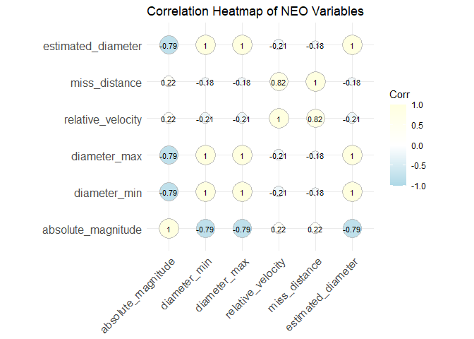
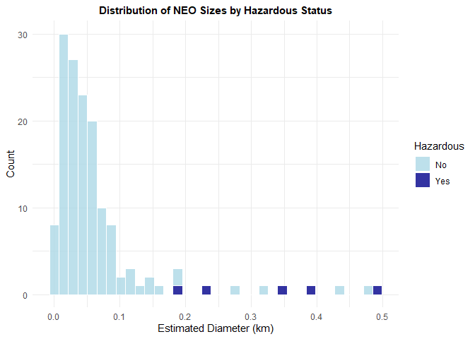
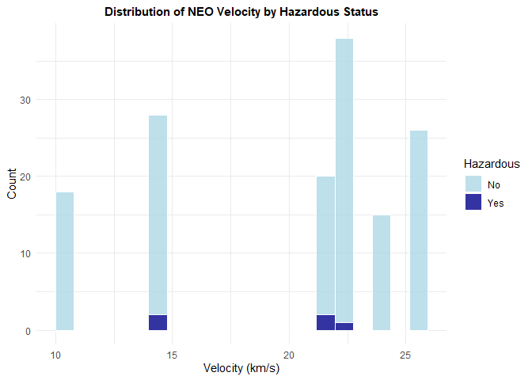
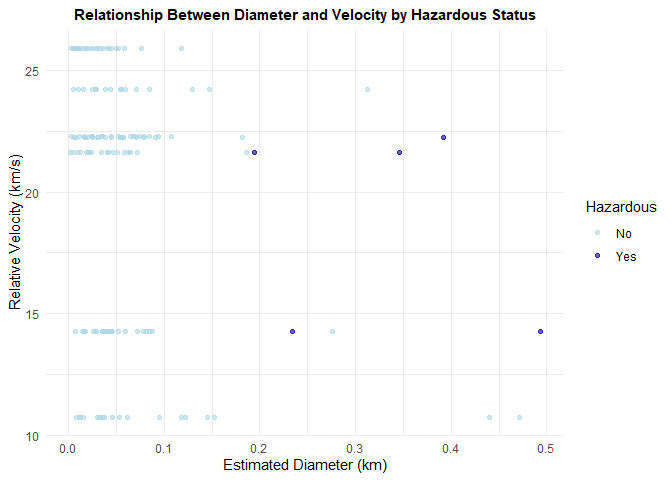
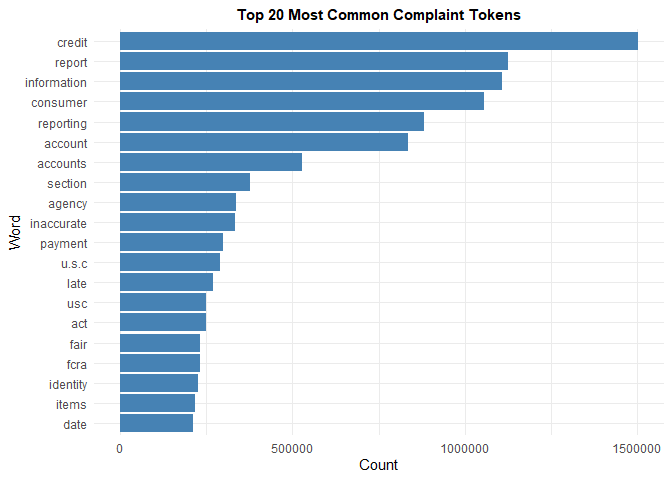
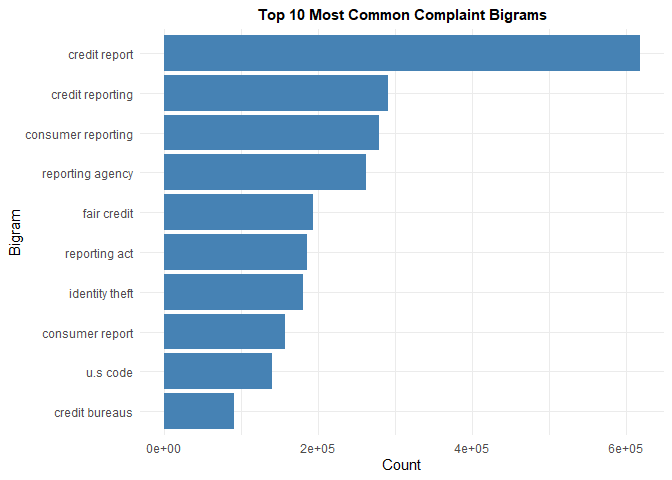
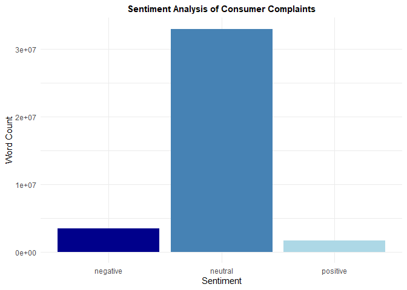

Homework 03 - APIs and Text Mining
================
Sophie Xu
March 7, 2025

### Introduction

This assignment aims to enhance skills in data retrieval via APIs,
exploratory data analysis (EDA), and natural language processing (NLP).
The analysis focuses on two datasets: NASA’s Near Earth Objects (NEOs)
and CFPM Consumer Complaints.

### 1 NASA Neo

The dataset is retrieved from NASA’s API
(<https://api.nasa.gov/neo/rest/v1/feed>?) using the query parameters:
start date, end date, and an API key generated from
<https://api.nasa.gov/>. Particularly, we chose the 7-day timeframe
between 2024-12-25 and 2024-12-31. After receiving the data in JSON
format, we converted it into a data frame with associated variables
including the NEO’s close approach date, its id and name, absolute
magnitude, minimum and maximum of its estimated diameter, relative
velocity, miss distance, orbiting body, and whether it is hazardous or
not. The dataset contained no missing values, with a total of 146 NEOs.

Then, we selected some numeric measurements for further exploration and
summarized their mean by date. Note that we created an estimated
diameter variable by taking the average of the minimum and maximum
estimated diameter for ease of use. The table shows substantial variance
in the average size and miss distance, and an unbalanced representation
of hazardous NEOs.

| date       | avg_estimated_diameter | avg_velocity | avg_miss_distance | hazardous_count | total_count |
|:-----------|-----------------------:|-------------:|------------------:|----------------:|------------:|
| 2024-12-25 |                  0.052 |       22.287 |          58727627 |               0 |          17 |
| 2024-12-26 |                  0.074 |       14.284 |          12109538 |               2 |          28 |
| 2024-12-27 |                  0.105 |       10.748 |          24721708 |               0 |          18 |
| 2024-12-28 |                  0.065 |       22.255 |          25589449 |               1 |          21 |
| 2024-12-29 |                  0.070 |       24.235 |          56113132 |               0 |          16 |
| 2024-12-30 |                  0.066 |       21.620 |          48927145 |               2 |          20 |
| 2024-12-31 |                  0.031 |       25.924 |          70664971 |               0 |          26 |

    ## [1] "Total near-Earth objects: 146"

To understand the data, we created a correlation heatmap of all the
numeric variables in the dataset. We can see that the minimum, maximum,
and mean of estimated diameter are perfectly correlated (corr $\approx$
1). The absolute magnitude is highly correlated with the diameter (corr
$\approx$ -0.79), and the relative velocity is positively correlated
with the miss distance (corr $\approx$ 0.82).

<!-- -->

A key question was whether larger or faster NEOs are more hazardous.
Through histograms and t-tests, we found that larger NEOs (measured by
diameter) are statistically more likely to be hazardous. The t-test
showed a significant result (p-value $\approx$ 0.0067). On the other
hand, there is no clear pattern in the distribution of velocity. The 95%
confidence interval captured zero, indicating that we can not rule out
the hypothesis that the relative velocity was not significant in
determining hazard status (p-value $\approx$ 0.5203).

<!-- --><!-- -->

    ## 
    ##  Welch Two Sample t-test
    ## 
    ## data:  hz$estimated_diameter and non_hz$estimated_diameter
    ## t = 5.0857, df = 4.0868, p-value = 0.006659
    ## alternative hypothesis: true difference in means is not equal to 0
    ## 95 percent confidence interval:
    ##  0.1269873 0.4268088
    ## sample estimates:
    ##  mean of x  mean of y 
    ## 0.33209086 0.05519279

    ## 
    ##  Welch Two Sample t-test
    ## 
    ## data:  hz$relative_velocity and non_hz$relative_velocity
    ## t = -0.69722, df = 4.464, p-value = 0.5203
    ## alternative hypothesis: true difference in means is not equal to 0
    ## 95 percent confidence interval:
    ##  -6.404609  3.749352
    ## sample estimates:
    ## mean of x mean of y 
    ##  18.81263  20.14026

Then, the difference in the relationship between diameter and velocity
by hazardous status is inspected. Due to the limitedness of the
unbalanced data, the relationship between diameter and velocity for
hazardous NEOs are not very clear from the scatter plot. The logistic
regression model again suggests that the estimated diameter plays a
significant role in predicting whether a NEO is hazardous (p-value
$\approx$ 0.0004), while the relative velocity does not (p-value
$\approx$ 0.1956).

<!-- -->

    ## 
    ## Call:
    ## glm(formula = hazardous ~ estimated_diameter + relative_velocity, 
    ##     family = binomial(link = "logit"), data = neo_df)
    ## 
    ## Coefficients:
    ##                    Estimate Std. Error z value Pr(>|z|)    
    ## (Intercept)        -10.3569     4.1604  -2.489 0.012796 *  
    ## estimated_diameter  17.9436     5.0952   3.522 0.000429 ***
    ## relative_velocity    0.2039     0.1575   1.294 0.195579    
    ## ---
    ## Signif. codes:  0 '***' 0.001 '**' 0.01 '*' 0.05 '.' 0.1 ' ' 1
    ## 
    ## (Dispersion parameter for binomial family taken to be 1)
    ## 
    ##     Null deviance: 43.568  on 145  degrees of freedom
    ## Residual deviance: 20.597  on 143  degrees of freedom
    ## AIC: 26.597
    ## 
    ## Number of Fisher Scoring iterations: 8

Overall, larger NEOs, based on diameter, are more likely to be
classified as hazardous, while the relative velocity does not appear to
significantly impact the hazard status.

### 2 CFPM Customer Complaints

The second dataset is retrieved from CFPB’s API
(<https://www.consumerfinance.gov/data-research/consumer-complaints/search/api/v1>)
using the query parameters: data received min, product, narrative, and
format. Note that we only fetched data since 2024-02-01 and filtered for
complaints related to “Credit reporting or other personal consumer
reports” and have a narrative, as the full dataset is very large. The
CSV data contains 628,690 entries and 18 variables, covering both
consumer information and complaint details. For the purpose of
performing NLP tasks, we will focus on the “Consumer complaint
narrative” variable which contains the customers’ complaints in textual
format.

    ## [1] 628690     18

    ##  Date received        Product          Sub-product           Issue          
    ##  Length:628690      Length:628690      Length:628690      Length:628690     
    ##  Class :character   Class :character   Class :character   Class :character  
    ##  Mode  :character   Mode  :character   Mode  :character   Mode  :character  
    ##                                                                             
    ##                                                                             
    ##                                                                             
    ##   Sub-issue         Consumer complaint narrative Company public response
    ##  Length:628690      Length:628690                Length:628690          
    ##  Class :character   Class :character             Class :character       
    ##  Mode  :character   Mode  :character             Mode  :character       
    ##                                                                         
    ##                                                                         
    ##                                                                         
    ##    Company             State             ZIP code             Tags          
    ##  Length:628690      Length:628690      Length:628690      Length:628690     
    ##  Class :character   Class :character   Class :character   Class :character  
    ##  Mode  :character   Mode  :character   Mode  :character   Mode  :character  
    ##                                                                             
    ##                                                                             
    ##                                                                             
    ##  Consumer consent provided? Submitted via      Date sent to company
    ##  Length:628690              Length:628690      Length:628690       
    ##  Class :character           Class :character   Class :character    
    ##  Mode  :character           Mode  :character   Mode  :character    
    ##                                                                    
    ##                                                                    
    ##                                                                    
    ##  Company response to consumer Timely response?   Consumer disputed?
    ##  Length:628690                Length:628690      Length:628690     
    ##  Class :character             Class :character   Class :character  
    ##  Mode  :character             Mode  :character   Mode  :character  
    ##                                                                    
    ##                                                                    
    ##                                                                    
    ##   Complaint ID     
    ##  Min.   : 8257365  
    ##  1st Qu.: 9039409  
    ##  Median : 9779862  
    ##  Mean   : 9831804  
    ##  3rd Qu.:10617193  
    ##  Max.   :12224194

We began by tokenizing the complaints to compute the frequency of words.
We see that “XXXX” is the most common word, followed by stop words.
After removing stop words, numbers, and irrelevant tokens like “XXXX”,
we identified the top 20 most common words, with “credit” being the most
frequent, appearing around 1,500,000 times. We now see words that
provides more context for the complaints, such as “inaccurate”, “late”.

<!-- -->

We then tokenized the complaints into bigrams to extract more insights.
The result reveals that “credit report” and “credit reporting” were
among the most common, reinforcing the dataset’s focus. Certain
combinations are also more meaningful now, such as “identify theft”
versus “identity”.

<!-- -->

By focusing on the top three issues, we identified key terms that
distinguish these complaints. For example, terms like
“informationisinaccurate” for “improper use of your report” and
“recuperate” for “problem with a company’s investigation into an
existing problem” stood out. The frequency of these unique terms dropped
significantly compared to the overall frequency, indicating their
specificity to the issues.

    ##                                                              Issue      n
    ##                                                             <char>  <int>
    ## 1:                            Incorrect information on your report 305536
    ## 2:                                     Improper use of your report 173300
    ## 3: Problem with a company's investigation into an existing problem 139743

| Issue                                                           | word                    |    n |       tf |       idf |   tf_idf |
|:----------------------------------------------------------------|:------------------------|-----:|---------:|----------:|---------:|
| Improper use of your report                                     | informationisinaccurate | 1118 | 8.70e-05 | 0.4054651 | 3.53e-05 |
| Improper use of your report                                     | whitout                 |  348 | 2.71e-05 | 1.0986123 | 2.98e-05 |
| Improper use of your report                                     | peacefully              |  571 | 4.44e-05 | 0.4054651 | 1.80e-05 |
| Improper use of your report                                     | showings                |  175 | 1.36e-05 | 1.0986123 | 1.50e-05 |
| Improper use of your report                                     | repesentations          |  147 | 1.14e-05 | 1.0986123 | 1.26e-05 |
| Incorrect information on your report                            | peacefully              | 1323 | 8.23e-05 | 0.4054651 | 3.34e-05 |
| Incorrect information on your report                            | tenacious               | 1136 | 7.07e-05 | 0.4054651 | 2.87e-05 |
| Incorrect information on your report                            | assent                  |  734 | 4.57e-05 | 0.4054651 | 1.85e-05 |
| Incorrect information on your report                            | tbese                   |  209 | 1.30e-05 | 1.0986123 | 1.43e-05 |
| Incorrect information on your report                            | instigate               |  205 | 1.28e-05 | 1.0986123 | 1.40e-05 |
| Problem with a company’s investigation into an existing problem | undertakings            |  301 | 3.49e-05 | 1.0986123 | 3.83e-05 |
| Problem with a company’s investigation into an existing problem | dependably              |  287 | 3.33e-05 | 1.0986123 | 3.65e-05 |
| Problem with a company’s investigation into an existing problem | recuperate              |  179 | 2.07e-05 | 1.0986123 | 2.28e-05 |
| Problem with a company’s investigation into an existing problem | achievement             |  149 | 1.73e-05 | 1.0986123 | 1.90e-05 |
| Problem with a company’s investigation into an existing problem | bestow                  |  147 | 1.70e-05 | 1.0986123 | 1.87e-05 |

Lastly, a sentiment analysis was conducted, showing that most tokens
were neutral, with negative ones slightly more than positive ones.
Negative words like “failed”, “harassment”, “incorrect” could be
associated with customer frustration.

    ##             word sentiment
    ##           <char>    <char>
    ##  1:      dispute  negative
    ##  2:   inaccurate  negative
    ##  3:    incorrect  negative
    ##  4:         fair  positive
    ##  5:       issues  negative
    ##  6:     accurate  positive
    ##  7:    violation  negative
    ##  8:      limited  negative
    ##  9:  permissible  positive
    ## 10:      adverse  negative
    ## 11:   reasonable  positive
    ## 12:     disputed  negative
    ## 13:       failed  negative
    ## 14:         debt  negative
    ## 15:      failure  negative
    ## 16:   harassment  negative
    ## 17:  significant  positive
    ## 18:     distress  negative
    ## 19: questionable  negative
    ## 20:     promptly  positive
    ##             word sentiment

<!-- -->

This exercise demonstrated how techniques like n-grams, Term
Frequency-Inverse Document Frequency (TF-IDF), and sentiment analysis
can significantly improve the depth and relevance of insights derived
from the data, helping to focus on more meaningful information.

### Conclusion

This analysis provided valuable insights into both datasets. For NEOs,
we determined that size is a more significant factor than velocity in
predicting the hazard status of asteroids. In the CFPM consumer
complaints dataset, we observed that key terms specific to certain
complaints helped distinguish them, and a sentiment analysis highlighted
the generally neutral tone of consumer complaints. Both datasets
demonstrated the power of combining exploratory data analysis with text
mining and NLP techniques to extract meaningful patterns and insights.
