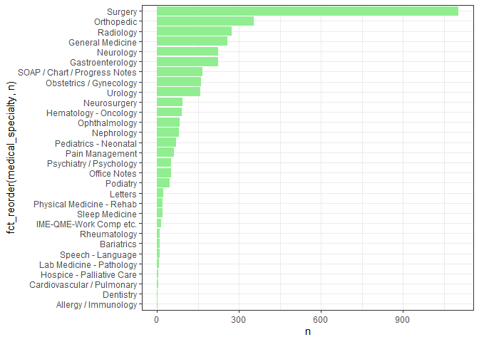
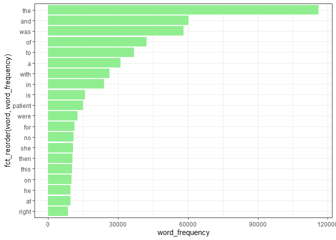
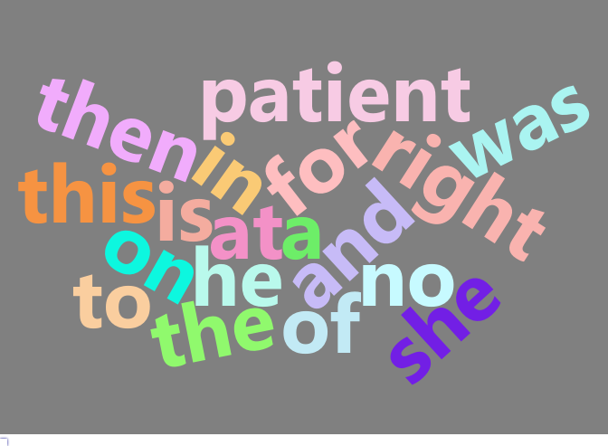
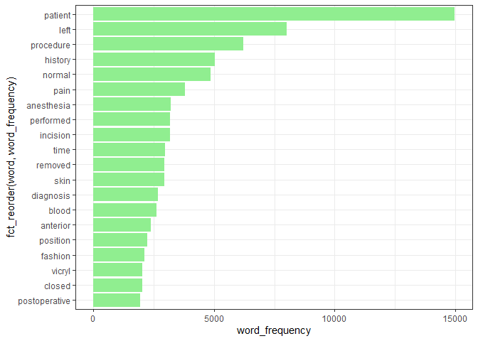
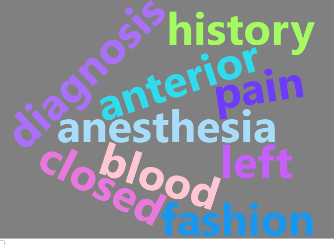
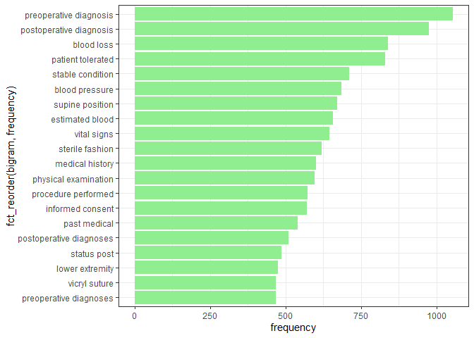
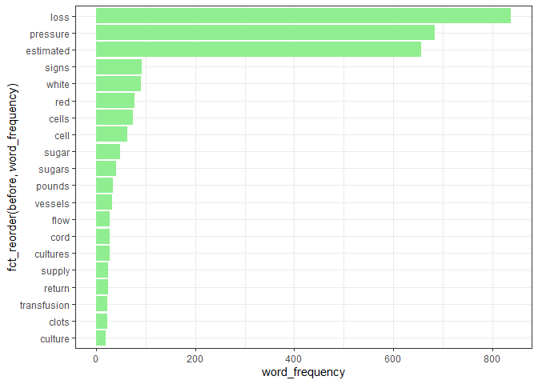
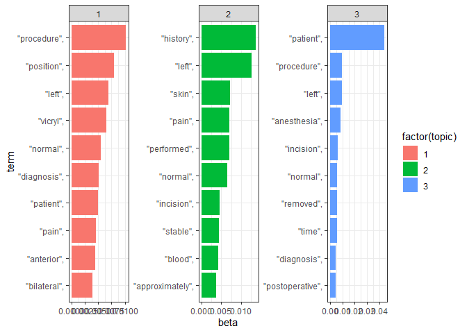

Lab 08 - Text Mining/NLP
================

# Learning goals

- Use `unnest_tokens()` and `unnest_ngrams()` to extract tokens and
  ngrams from text
- Use dplyr and ggplot2 to analyze and visualize text data
- Try a theme model using `topicmodels`

# Lab description

For this lab we will be working with the medical record transcriptions
from <https://www.mtsamples.com/> available at
<https://github.com/JSC370/JSC370-2025/tree/main/data/medical_transcriptions>.

# Deliverables

1.  Questions 1-7 answered, knit to pdf or html output uploaded to
    Quercus.

2.  Render the Rmarkdown document using `github_document` and add it to
    your github site. Add link to github site in your html.

### Setup packages

You should load in `tidyverse`, (or `data.table`), `tidytext`,
`wordcloud2`, `tm`, and `topicmodels`.

## Read in the Medical Transcriptions

Loading in reference transcription samples from
<https://www.mtsamples.com/>

    ## # A tibble: 6 × 3
    ##   description                                    medical_specialty transcription
    ##   <chr>                                          <chr>             <chr>        
    ## 1 A 23-year-old white female presents with comp… Allergy / Immuno… "SUBJECTIVE:…
    ## 2 Consult for laparoscopic gastric bypass.       Bariatrics        "PAST MEDICA…
    ## 3 Consult for laparoscopic gastric bypass.       Bariatrics        "HISTORY OF …
    ## 4 2-D M-Mode. Doppler.                           Cardiovascular /… "2-D M-MODE:…
    ## 5 2-D Echocardiogram                             Cardiovascular /… "1.  The lef…
    ## 6 Morbid obesity.  Laparoscopic antecolic anteg… Bariatrics        "PREOPERATIV…

------------------------------------------------------------------------

## Question 1: What specialties do we have?

We can use `count()` from `dplyr` to figure out how many different
medical specialties are in the data. Are these categories related?
overlapping? evenly distributed? Make a bar plot.

<!-- -->

**Answer:** **The data isn’t evenly distributed, most of the
transcriptions are from the surgeries. Also, there aren’t much relation
between categories, e.g. surgery and neurosurgery is only somewhat
related. The categories seem like distinct specialties, and there isn’t
a lot of overlapping.**

------------------------------------------------------------------------

## Question 2: Tokenize

- Tokenize the the words in the `transcription` column
- Count the number of times each token appears
- Visualize the top 20 most frequent words with a bar plot
- Create a word cloud of the top 20 most frequent words

### Explain what we see from this result. Does it makes sense? What insights (if any) do we get?

<!-- --><!-- -->

**Answer:** **We see that these most frequent words are mostly stop
words that do not have any meaning in the medical context.**

------------------------------------------------------------------------

## Question 3: Stopwords

- Redo Question 2 but remove stopwords
- Check `stopwords()` library and `stop_words` in `tidytext`
- Use regex to remove numbers as well
- Try customizing your stopwords list to include 3-4 additional words
  that do not appear informative

### What do we see when you remove stopwords and then when you filter further? Does it give us a better idea of what the text is about?

<!-- --><!-- -->

**Answer:** **The filtered result is now composed of mostly
medical-related words, which better represents the text. We can also see
the word count has drastically decreased (from 120,000 to 15,000).**

------------------------------------------------------------------------

## Question 4: ngrams

Repeat question 2, but this time tokenize into bi-grams. How does the
result change if you look at tri-grams? Note we need to remove stopwords
a little differently. You don’t need to recreate the wordclouds.

<!-- -->

**Answer:** **The maximum word count has been further reduced, and the
bigrams have more insights as the combinations of words provide more
context than a single word. Note we are NOT doing the trigrams anymore
as instructed in the tutorial.**

------------------------------------------------------------------------

## Question 5: Examining words

Using the results from the bigram, pick a word and count the words that
appear before and after it, and create a plot of the top 20.

<!-- -->

**Answer:** **We can see some common combinations, e.g. blood pressure,
white/red blood cell, etc.**

------------------------------------------------------------------------

## Question 6: Words by Specialties

Which words are most used in each of the specialties? You can use
`group_by()` and `top_n()` from `dplyr` to have the calculations be done
within each specialty. Remember to remove stopwords. How about the 5
most used words?

    ## # A tibble: 150 × 3
    ## # Groups:   medical_specialty [30]
    ##    medical_specialty    word         word_frequency
    ##    <chr>                <chr>                 <int>
    ##  1 Allergy / Immunology allergies                 4
    ##  2 Allergy / Immunology allegra                   3
    ##  3 Allergy / Immunology prescription              3
    ##  4 Allergy / Immunology sprays                    3
    ##  5 Allergy / Immunology erythematous              2
    ##  6 Bariatrics           patient                  29
    ##  7 Bariatrics           history                  21
    ##  8 Bariatrics           abdomen                  20
    ##  9 Bariatrics           procedure                18
    ## 10 Bariatrics           weight                   15
    ## # ℹ 140 more rows

**Answer:** **For example, for the Allergy / Immunology specialty, the
most used five words are “allergies”, “allegra”, “prescription”,
“sprays”, and “erythematous”, which is reasonable.**

------------------------------------------------------------------------

## Question 7: Topic Models

See if there are any themes in the data by using a topic model (LDA).

- you first need to create a document term matrix
- then you can try the LDA function in `topicmodels`. Try different k
  values.
- create a facet plot of the results from the LDA (see code from
  lecture)

<!-- -->

    ## Warning in geom_col(snow.legend = FALSE): Ignoring unknown parameters:
    ## `snow.legend`

<!-- -->

**Answer:** **We can sort of see the themes of the generated topic
groupings. Topic 1 resolves around surgical procedures, topic 2 is
mostly about medical history and physical examination, while topic 3 has
top words regarding postoperative care and patient management.**

------------------------------------------------------------------------
