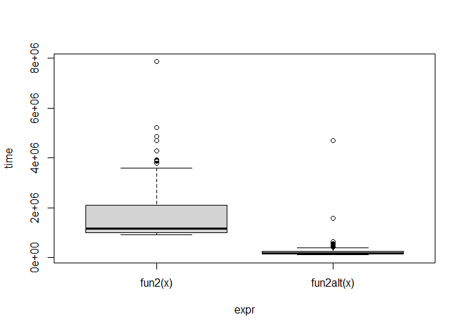
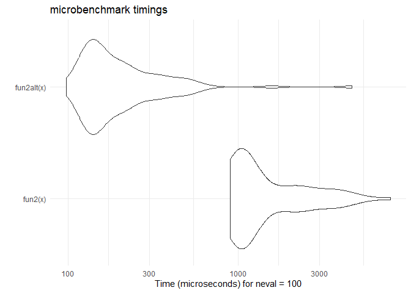

Lab 9 - HPC
================

# Learning goals

In this lab, you are expected to practice the following skills:

- Evaluate whether a problem can be parallelized or not.
- Practice with the parallel package.
- Use Rscript to submit jobs.

## Problem 1

Give yourself a few minutes to think about what you learned about
parallelization. List three examples of problems that you believe may be
solved using parallel computing, and check for packages on the HPC CRAN
task view that may be related to it.

- `doParallel`, `mlr`, `foreach`, `foParallel` -\> supports
  cross-validation in machine learning and helps parallelize model
  training
- `boot`, `parallel` -\> supports bootstrapping, and parallelize
  re-sampling
- `parallel`, `RcppParallel`, `rstan`, `nimle` -\> assists in
  implementing Markov Chain Monte Carlo, and Bayesian modeling and
  inferences

## Problem 2: Pre-parallelization

The following functions can be written to be more efficient without
using `parallel`:

1.  This function generates a `n x k` dataset with all its entries
    having a Poisson distribution with mean `lambda`.

``` r
fun1 <- function(n = 100, k = 4, lambda = 4) {
  x <- NULL
  
  for (i in 1:n)
    x <- rbind(x, rpois(k, lambda))
  
  return(x)
}

fun1alt <- function(n = 100, k = 4, lambda = 4) {
  # pre-allocate memory
  matrix(rpois(n * k, lambda = lambda), ncol = k)
}

# Benchmarking
microbenchmark::microbenchmark(
  fun1(),
  fun1alt(),
  unit = "ns"
)
```

    ## Unit: nanoseconds
    ##       expr    min     lq   mean median     uq      max neval
    ##     fun1() 327400 377450 631477 427300 510100 17349800   100
    ##  fun1alt()  13400  17850  46718  21800  25150  2119800   100

How much faster?

*The second function utilizing matrices is much faster than the first
one (13,400 ns \< 327,400 ns).*

2.  Find the column max (hint: Checkout the function `max.col()`).

``` r
# Data Generating Process (10 x 10,000 matrix)
set.seed(1234)
x <- matrix(rnorm(1e4), nrow=10)

# Find each column's max value
fun2 <- function(x) {
  apply(x, 2, max)
}

fun2alt <- function(x) {
  # YOUR CODE HERE
  x[cbind(max.col(t(x)), 1:ncol(x))]
}

# Benchmarking
bench <- 
  microbenchmark::microbenchmark(
    fun2(x),
    fun2alt(x),
    unit = "us"
  )
```

``` r
plot(bench)
```

<!-- -->

``` r
ggplot2::autoplot(bench) +
ggplot2::theme_minimal()
```

<!-- -->

*We can see the second function utilizing matrices is again
significantly faster than the first one.*

## Problem 3: Parallelize everything

We will now turn our attention to non-parametric
[bootstrapping](https://en.wikipedia.org/wiki/Bootstrapping_(statistics)).
Among its many uses, non-parametric bootstrapping allow us to obtain
confidence intervals for parameter estimates without relying on
parametric assumptions.

The main assumption is that we can approximate many experiments by
resampling observations from our original dataset, which reflects the
population.

This function implements the non-parametric bootstrap:

``` r
my_boot <- function(dat, stat, R, ncpus = 1L) {
  
  # Getting the random indices
  n <- nrow(dat)
  idx <- matrix(sample.int(n, n*R, TRUE), nrow=n, ncol=R)
 
  # Making the cluster using `ncpus`
  # STEP 1: GOES HERE
  cl <- makePSOCKcluster(ncpus)
  
  # STEP 2: GOES HERE
  # send variables to worker nodes 
    # note they are running in isolated environments, so there are no global variables
    # idx -> re-sampling indices, dat -> dataset, stat -> function to compute estimates
  clusterExport(cl, varlist = c("idx", "dat", "stat"), envir = environment()) 
  
  # STEP 3: THIS FUNCTION NEEDS TO BE REPLACED WITH parLapply
  ans <- parLapply(cl, seq_len(R), function(i) {
    stat(dat[idx[,i], , drop=FALSE])
  })
  
  # Coercing the list into a matrix
  ans <- do.call(rbind, ans)
  
  # STEP 4: GOES HERE
  stopCluster(cl) # free up system resources
  # on.exit(stopCluster(cl)) # prevents memory leak
  ans
  
}
```

1.  Use the previous pseudocode, and make it work with `parallel`. Here
    is just an example for you to try:

``` r
# Bootstrap of a linear regression model
my_stat <- function(d) coef(lm(y ~ x, data = d))

# DATA SIM
set.seed(1)
n <- 500 
R <- 1e4
x <- cbind(rnorm(n)) 
y <- x*5 + rnorm(n)

# Check if we get something similar as lm
ans0 <- confint(lm(y ~ x))
cat("OLS CI \n")
```

    ## OLS CI

``` r
print(ans0)
```

    ##                  2.5 %     97.5 %
    ## (Intercept) -0.1379033 0.04797344
    ## x            4.8650100 5.04883353

``` r
ans1 <- my_boot(dat = data.frame(x, y), my_stat, R = R, ncpus = 4)
qs <- c(.025, .975)
cat("Bootstrap CI \n")
```

    ## Bootstrap CI

``` r
print(t(apply(ans1, 2, quantile, probs = qs)))
```

    ##                   2.5%      97.5%
    ## (Intercept) -0.1386903 0.04856752
    ## x            4.8685162 5.04351239

2.  Check whether your version actually goes faster than the
    non-parallel version:

``` r
# your code here
detectCores()
```

    ## [1] 8

``` r
# non-parallel
system.time(my_boot(dat = data.frame(x, y), my_stat, R = 4000, ncpus = 1L))
```

    ##    user  system elapsed 
    ##    0.07    0.01    5.53

``` r
# parallel 8 cores
system.time(my_boot(dat = data.frame(x, y), my_stat, R = 4000, ncpus = 8L))
```

    ##    user  system elapsed 
    ##    0.07    0.10    3.25

*The parallel version indeed runs faster than the non-parallel version
(3.25s \< 5.53s).*

## Problem 4: Compile this markdown document using Rscript

Once you have saved this Rmd file, try running the following command in
your terminal:

``` bash
Rscript --vanilla -e 'rmarkdown::render("C:\Users\xsoph\OneDrive\Documents\RStudio Projects\JSC370-Coursework\lab09\lab09-hpc.Rmd")' &
```

Where `[full-path-to-your-Rmd-file.Rmd]` should be replace with the full
path to your Rmd file… :).
