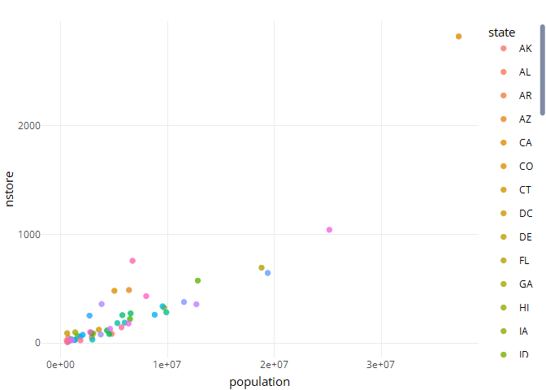
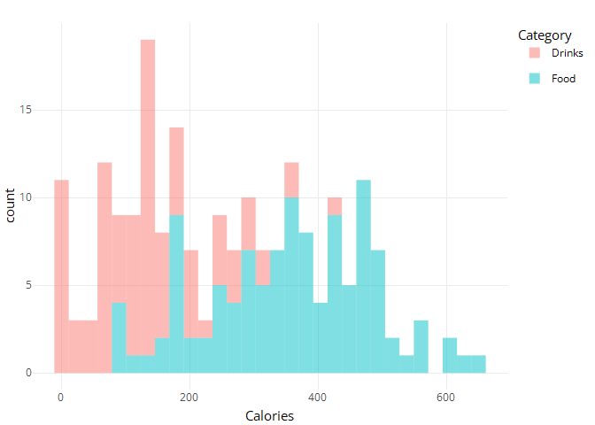
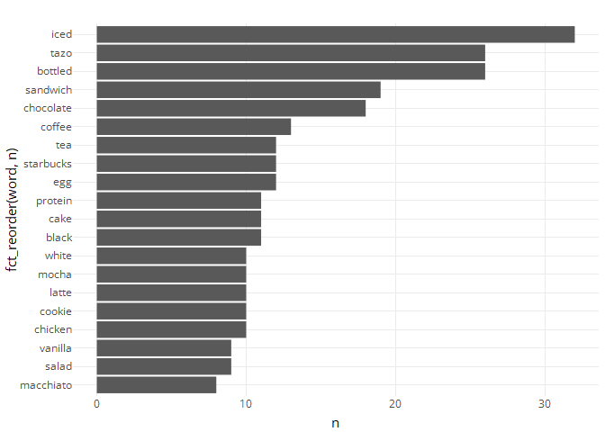
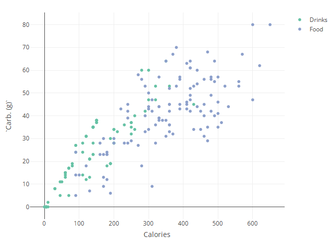
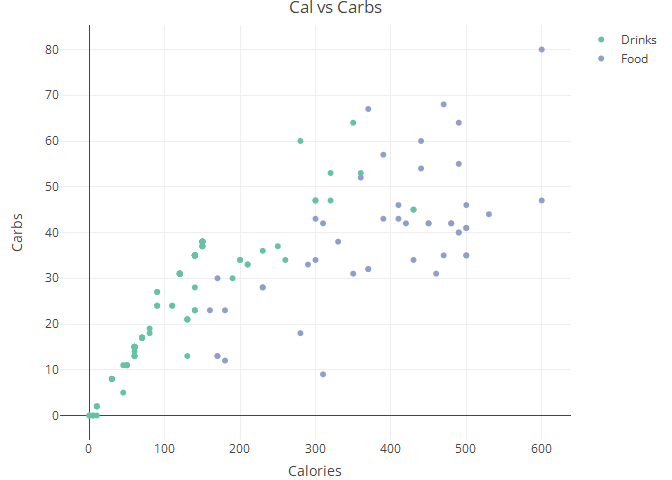
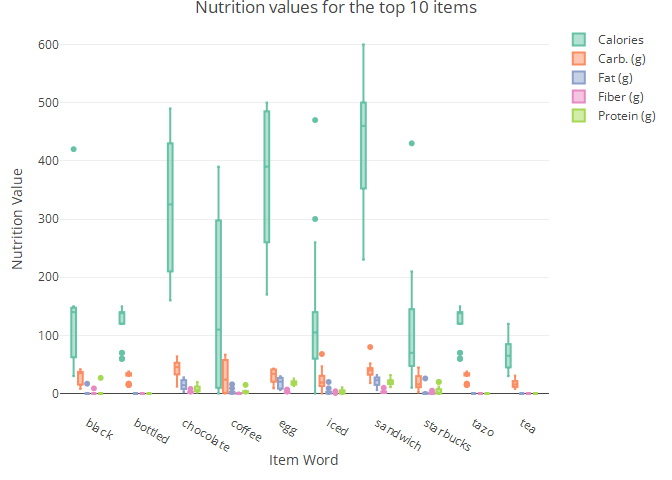
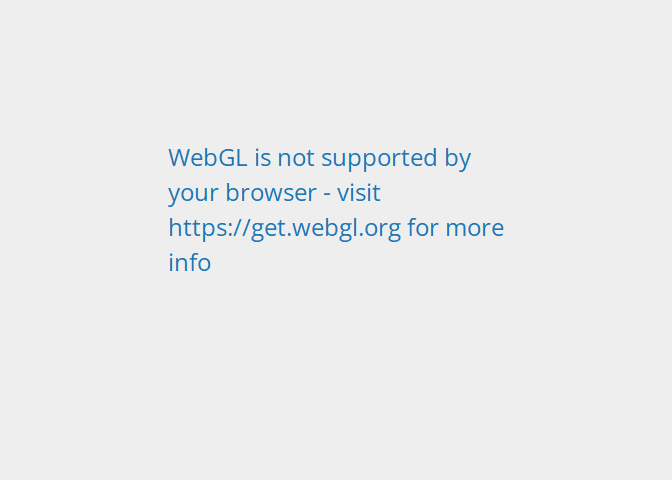
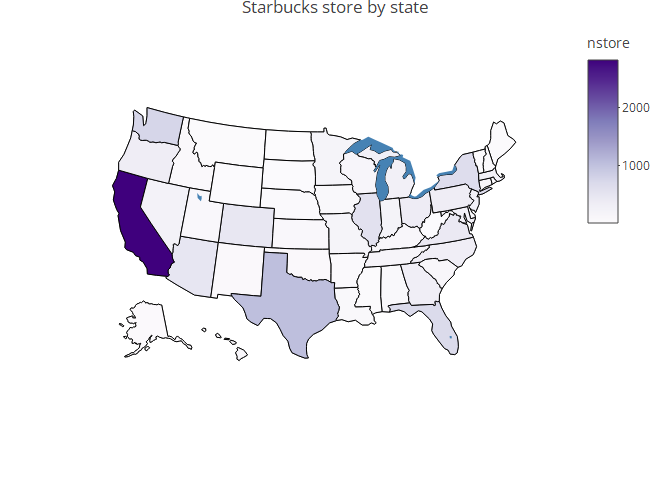
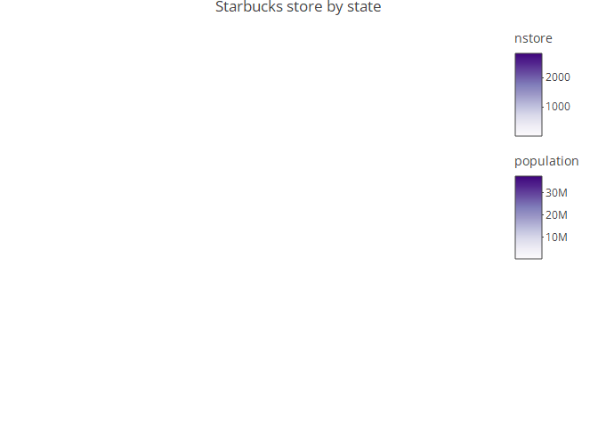

Lab 11 - Interactive Visualization
================

# Learning Goals

- Read in and process Starbucks data.
- Create interactive visualizations of different types using `plot_ly()`
  and `ggplotly()`.
- Customize the hoverinfo and other plot features.
- Create a Choropleth map using `plot_geo()`.

# Lab Description

We will work with two Starbucks datasets, one on the store locations
(global) and one for the nutritional data for their food and drink
items. We will do some text analysis of the menu items.

# Deliverables

Upload an html file to Quercus and make sure the figures remain
interactive.

# Steps

### 0. Install and load libraries

### 1. Read in the data

- There are 4 datasets to read in, Starbucks locations, Starbucks
  nutrition, US population by state, and US state abbreviations. All of
  them are on the course GitHub.

``` r
sb_locs <- read_csv("https://raw.githubusercontent.com/JSC370/JSC370-2025/refs/heads/main/data/starbucks/starbucks-locations.csv")

sb_nutr <- read_csv("https://raw.githubusercontent.com/JSC370/JSC370-2025/refs/heads/main/data/starbucks/starbucks-menu-nutrition.csv")

usa_pop <- read_csv("https://raw.githubusercontent.com/JSC370/JSC370-2025/refs/heads/main/data/starbucks/us_state_pop.csv")

usa_states<-read_csv("https://raw.githubusercontent.com/JSC370/JSC370-2025/refs/heads/main/data/starbucks/states.csv")
```

### 2. Look at the data

- Inspect each dataset to look at variable names and ensure it was
  imported correctly.

``` r
#head(sb_locs)
#head(sb_nutr)
#head(usa_pop)
#head(usa_states)
print(colnames(sb_locs))
```

    ##  [1] "Store Number"   "Store Name"     "Ownership Type" "Street Address"
    ##  [5] "City"           "State/Province" "Country"        "Postcode"      
    ##  [9] "Phone Number"   "Timezone"       "Longitude"      "Latitude"

``` r
print(colnames(sb_nutr))
```

    ## [1] "Item"        "Category"    "Calories"    "Fat (g)"     "Carb. (g)"  
    ## [6] "Fiber (g)"   "Protein (g)"

``` r
print(colnames(usa_pop))
```

    ## [1] "state"      "population"

``` r
print(colnames(usa_states))
```

    ## [1] "State"        "Abbreviation"

### 3. Format and merge the data

- Subset Starbucks data to the US.
- Create counts of Starbucks stores by state.
- Merge population in with the store count by state.
- Inspect the range values for each variable.

``` r
sb_usa <- sb_locs |> filter(Country == "US")

sb_locs_state <- sb_usa |>
  rename(state = "State/Province") |>
  group_by(state) |>
  summarize(nstore = n())

# need state abbreviations
usa_pop_abbr <- 
  full_join(usa_pop, usa_states,
            by = join_by(state == State)
            ) 
  
sb_locs_state <- full_join(sb_locs_state, usa_pop_abbr, by = join_by(state == Abbreviation))
sb_locs_state <- sb_locs_state |> rename(state_name = "state.y")
```

### 4. Use `ggplotly` for EDA

Answer the following questions:

- Are the number of Starbucks proportional to the population of a state?
  (scatterplot)

- Is the caloric distribution of Starbucks menu items different for
  drinks and food? (histogram)

- What are the top 20 words in Starbucks menu items? (bar plot)

``` r
p1 <- ggplot(sb_locs_state, aes(x=population, y=nstore, colour=state)) +
  geom_point(alpha = 0.8) + 
  theme_minimal()

ggplotly(p1)
```

<!-- -->

- 4a) Answer: Yes, the data points roughly align with a positive
  exponential curve, the number of stores are increasing as the
  population increases.

``` r
p2 <- ggplot(sb_nutr, aes(x=Calories, fill=Category)) +
  geom_histogram(alpha = 0.5, bins=30) + 
  theme_minimal()

ggplotly(p2)
```

<!-- -->

- 4b) Answer: The expected calories of drinks are less than foods from
  the Starbucks menu.

``` r
p3 <- sb_nutr |>
  unnest_tokens(word, Item, token="words") |>
  count(word, sort = T) |>
  head(20) |>
  ggplot(aes(fct_reorder(word, n), n)) +
  geom_col() +
  coord_flip() + 
  theme_minimal()

ggplotly(p3)
```

<!-- -->

- 4c) Answer: The top 20 words are listed in the bar graph. We can see
  that “iced” is the most frequent word, even higher than “coffee”.

### 5. Scatterplots using `plot_ly()`

- Create a scatterplot using `plot_ly()` representing the relationship
  between calories and carbs. Color the points by category (food or
  beverage). Is there a relationship, and do food or beverages tend to
  have more calories?

``` r
sb_nutr |>
  plot_ly(x = ~Calories, y = ~`Carb. (g)`,
          type = "scatter", mode = "markers", color = ~Category)
```

<!-- -->

- 5a) Answer: There is a positive trend, the more carbs, the more
  calories. Moreover, food tend to have more calories than drinks.

- Repeat this scatterplot but for the items that include the top 10
  words. Color again by category, and add hoverinfo specifying the word
  in the item name. Add layout information to title the chart and the
  axes, and enable `hovermode = "compare"`.

- What are the top 10 words and is the plot much different than above?

``` r
tokens <- sb_nutr |>
  unnest_tokens(word, Item, token="words")

topwords <- tokens |>
  group_by(word) |>
  summarise(word_frequency = n()) |>
  arrange(across(word_frequency, desc)) |>
  head(10)

print(topwords$word)
```

    ##  [1] "iced"      "bottled"   "tazo"      "sandwich"  "chocolate" "coffee"   
    ##  [7] "egg"       "starbucks" "tea"       "black"

``` r
tokens |>
  filter(word %in% topwords$word) |>
  plot_ly(
    x = ~Calories,
    y = ~`Carb. (g)`,
    type = "scatter",
    mode = "markers",
    color = ~Category,
    hoverinfo = "text",
    text = ~paste0("Item: ", word)
  ) |>
  layout(
    title = "Cal vs Carbs",
    xaxis = list(title = "Calories"),
    yaxis = list(title = "Carbs"),
    hovermode = "compare"
  )
```

<!-- -->

- 5b) Answer: The top 10 words are printed, the overall trend is the
  same as the plot above, but the data points are more evenly
  distributed between food and drink.

### 6. `plot_ly` Boxplots

- Create a boxplot of all of the nutritional variables in groups by the
  10 item words.
- Which top word has the most calories? Which top word has the most
  protein?

``` r
sb_nutr_long <- tokens |>
  filter(word %in% topwords$word) |>
  pivot_longer(cols = c(Calories, `Fat (g)`, `Carb. (g)`, `Fiber (g)`, `Protein (g)`),
               names_to = "Nutrient", values_to = "Value")

plot_ly(data = sb_nutr_long, x=~word, y=~Value, color = ~Nutrient, type = "box") |>
  layout(title = "Nutrition values for the top 10 items",
         xaxis = list(title = "Item Word"),
         yaxis = list(title = "Nutrition Value"),
         boxmode = "group")
```

<!-- -->

- 6)  Answer: It seems like sandwich has the most calories and protein
      out of the top items.

### 7. 3D Scatterplot

- Create a 3D scatterplot between Calories, Carbs, and Protein for the
  items containing the top 10 words
- Do you see any patterns (clusters or trends)?

``` r
tokens |>
  filter(word %in% topwords$word) |>
  plot_ly(
    x=~Calories,
    y=~`Carb. (g)`,
    z=~`Protein (g)`,
    color=~word,
    type = "scatter3d",
    mode="markers",
    marker=list(size = 5)
  ) |>
  layout(
    title = "3D Scatterplot of Calories, Carbs, and Protein",
    scene = list(
      xaxis = list(title = "Calories"),
      yaxis = list(title = "Carbs"),
      zaxis = list(title = "Protein")
    )
  )
```

<!-- -->

- 7)  Answer: The relationships between Protein vs Carbs, and Protein vs
      Calories are relatively weak compared to Carbs vs Calories. We can
      see clustering around the trend line between Carbs vs Calories.

### 8. `plot_ly` Map

- Create a map to visualize the number of stores per state, and another
  for the population by state. Add custom hover text. Use subplot to put
  the maps side by side.
- Describe the differences if any.

``` r
# Set up mapping details
set_map_details <- list(
  scope = 'usa',
  projection = list(type = 'albers usa'),
  showlakes = TRUE,
  lakecolor = toRGB('steelblue')
)

# Make sure both maps are on the same color scale
shadeLimit <- 125

# Create hover text
sb_locs_state$hover <- with(sb_locs_state, paste("Number of Starbucks: ", nstore, '<br>', "State: ", state_name, '<br>', "Population: ", population))

# Create the map
map1 <- plot_geo(sb_locs_state, locationmode = "USA-states") |>
  add_trace(z=~nstore, text=~hover, locations=~state, color=~nstore, colors="Purples") |>
  layout(title = "Starbucks store by state", geo=set_map_details)
map1
```

<!-- -->

``` r
map2 <- plot_geo(sb_locs_state, locationmode = "USA-states") |>
  add_trace(z=~population, text=~hover, locations=~state, color=~population, colors="Purples") |>
  layout(title = "Starbucks store by state", geo=set_map_details)
map2
```

<!-- -->

``` r
subplot(map1, map2)
```

<!-- -->

- 8)  Answer: The two plots are very similar, demonstrating the strong
      correlation between population and the number of stores.
